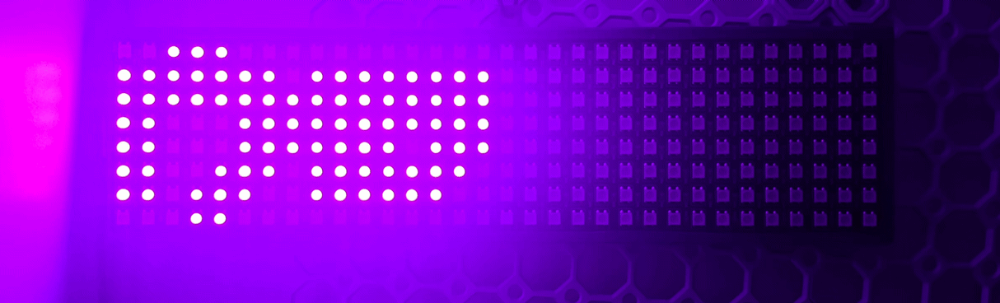

# WLED Hebrew Text Renderer

Display Hebrew, English, or mixed-script text on a WLED LED matrix over your local network.

Renders text using Pillow, maps pixels to LED indices, and sends frames via UDP using WLED's DNRGB protocol. Designed for a **32x8 LED matrix** but configurable for other sizes.

## Demo



## Features

- Hebrew and English text with automatic per-character font selection
- 6 built-in Hebrew fonts (auto-downloaded from Google Fonts)
- Static display or smooth scrolling
- Configurable colors (RGB or hex)
- `--reverse` flag for correct Hebrew display order
- Disk-based render cache for fast repeated calls
- Preview export (PNG for static, animated GIF for scroll)

## Requirements

- Python 3.12+
- [Pillow](https://pypi.org/project/Pillow/)
- A [WLED](https://kno.wled.ge/) controller on your network

## Installation

```bash
git clone https://github.com/baget/wled-hebrew.git
cd wled-hebrew
pip install Pillow
```

Or with [uv](https://docs.astral.sh/uv/):

```bash
uv sync
```

Fonts are downloaded automatically on first run to the `fonts/` directory.

## Usage

### Basic examples

```bash
# Display Hebrew text
python3 main.py --host wled1.local --text "שלום עולם" --fg "255,100,0" --reverse

# Display English text
python3 main.py --host 192.168.1.50 --text "Hello!" --fg "0,255,0"

# Scrolling text
python3 main.py --host wled1.local --text "שלום עולם" --scroll --reverse

# Save a preview image without sending (still requires --host)
python3 main.py --host wled1.local --text "שלום" --save-preview preview.png --reverse
```

### All options

| Flag | Description | Default |
|------|-------------|---------|
| `--host` | WLED hostname or IP (required) | — |
| `--text` | Text to display (required) | — |
| `--fg` | Foreground color (`R,G,B` or `RRGGBB` hex) | `255,255,255` |
| `--bg` | Background color (`R,G,B` or `RRGGBB` hex) | `0,0,0` |
| `--reverse` | Reverse text order (for Hebrew to display correctly) | off |
| `--scroll` | Enable scrolling mode | off |
| `--speed` | Scroll speed in frames per second | `15` |
| `--loops` | Scroll cycles (`0` = infinite) | `1` |
| `--timeout` | Seconds before WLED reverts (`255` = permanent) | `5` |
| `--port` | WLED UDP port | `21324` |
| `--hebrew-font` | Hebrew font face (see below) | `noto-sans` |
| `--save-preview` | Save preview to file (PNG or GIF) | — |
| `--no-cache` | Disable render cache | off |
| `--clear-cache` | Clear cached renders and exit | — |

### Hebrew fonts

| Name | Font |
|------|------|
| `noto-sans` | Noto Sans Hebrew Bold |
| `noto-serif` | Noto Serif Hebrew |
| `frank-ruhl` | Frank Ruhl Libre |
| `rubik` | Rubik Bold |
| `heebo` | Heebo Bold |
| `secular-one` | Secular One |

```bash
python3 main.py --host wled1.local --text "שלום" --hebrew-font secular-one --reverse
```

## Home Assistant Integration

### Setup

1. Copy `main.py` and the `fonts/` directory to `/config/scripts/wled-heb/`
2. Install Pillow: `pip3 install Pillow`
3. Add to `configuration.yaml`:

```yaml
shell_command:
  wled_hebrew_text: >
    python3 /config/scripts/wled-heb/main.py
    --host {{ host }}
    --text "{{ text }}"
    --fg "{{ fg | default('255,255,255') }}"
    --bg "{{ bg | default('0,0,0') }}"
    --timeout {{ timeout | default(5) }}
    --hebrew-font {{ hebrew_font | default('noto-sans') }}
    --reverse
    --scroll --speed {{ speed | default(15) }} --loops {{ loops | default(1) }}
```

### Automation example

```yaml
automation:
  - alias: "Welcome home message"
    trigger:
      - platform: state
        entity_id: person.oren
        to: "home"
    action:
      - service: shell_command.wled_hebrew_text
        data:
          host: "wled1.local"
          text: "ברוך הבא"
          fg: "255,100,0"
          reverse: true
          scroll: true
```

## Matrix Configuration

Default settings match a 32x8 matrix with:

- **1st LED:** Top-left
- **Orientation:** Horizontal
- **Wiring:** Non-serpentine (all rows left-to-right)

To change the matrix size, edit `MATRIX_W` and `MATRIX_H` at the top of `main.py`.

## How it works

1. **Render** — Text is drawn at 48px using Pillow with per-character font selection (Hebrew vs Latin), then scaled down to 8px height
2. **Threshold** — Anti-aliased pixels are snapped to foreground/background for crisp LED output
3. **Map** — Pixel coordinates are mapped to LED indices based on the matrix wiring layout
4. **Send** — Pixel data is sent via UDP using WLED's DNRGB protocol

## License

MIT
